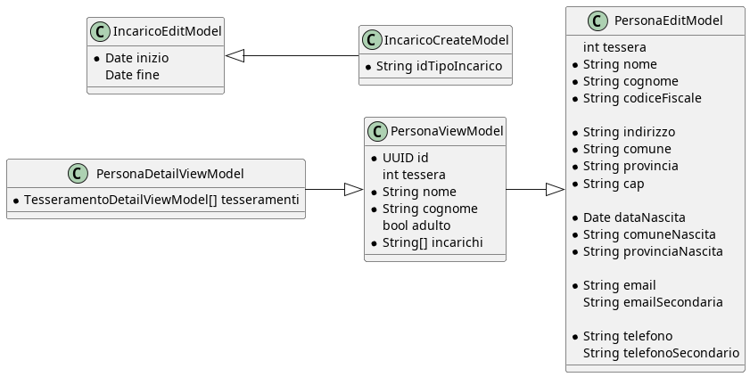
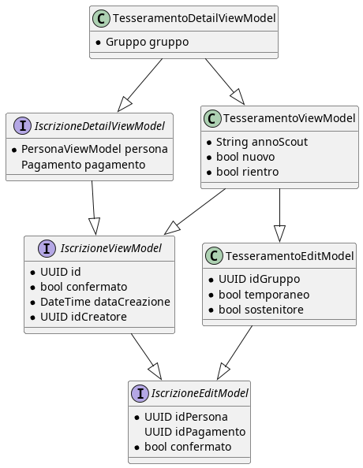
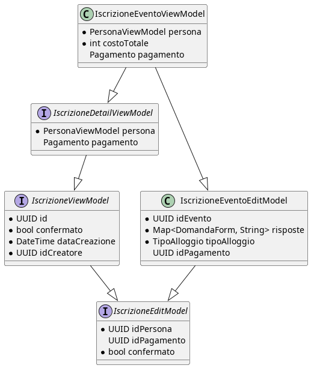
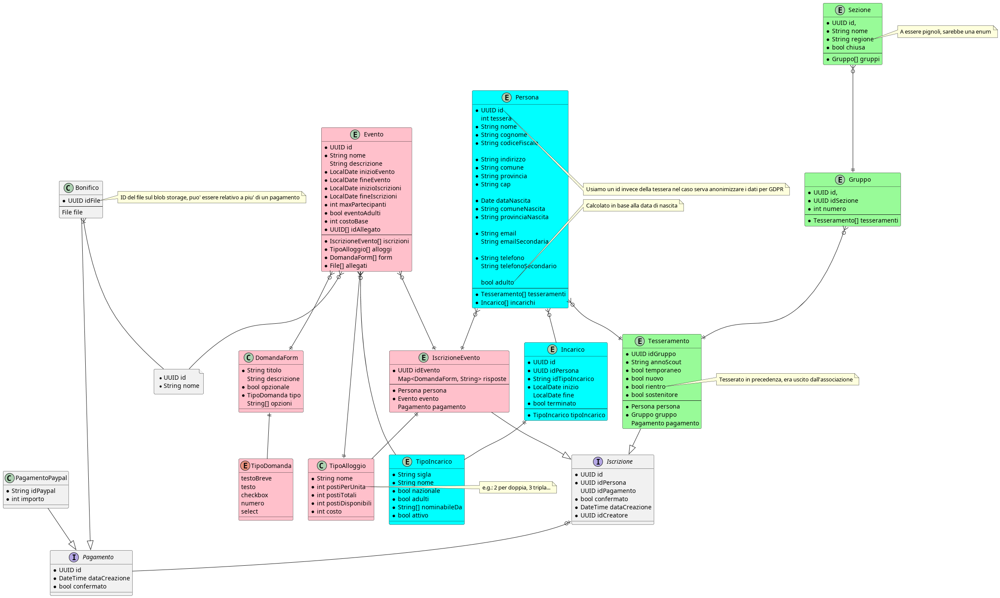

# Indice

1.  [Domini](#orgf3f0399)
    1.  [Anagrafica](#org6fcb17a)
    2.  [Tesseramenti](#org72433d4)
    3.  [Eventi](#org7949c59)
    4.  [Formazione](#org7a06f31)
2.  [Gestione dei permessi](#org943c971)
    1.  [Autenticazione](#org0e853a4)
    2.  [Permessi](#org29c0b07)
        1.  [Anagrafica (e tesseramenti)](#org87b5aeb)
        2.  [Eventi](#org8d7da08)
3.  [API](#orgd19edab)
    1.  [Persone](#org15eea98)
        1.  [Incarichi](#org4df7ddd)
    2.  [Tesseramenti](#org9bf451e)
    3.  [Iscrizioni a eventi](#orgcbf99a4)
4.  [Schema ER](#org5290a77)

# Domini

## Anagrafica

Gestione dei dati delle persone coinvolte nelle attivita&rsquo; del CNGEI: tesserati e non (e.g. sostenitori, ragazzi in prova, soggetti con assicurazione temporanea, genitori?, segreteria&#x2026;)

-   CRUD<a id="fnr.1" class="footref" href="#fn.1" role="doc-backlink">1</a>
-   Auditing di chi accede a quali dati (e.g. dati sensibili ai fini GDPR)

## Tesseramenti

Iscrizioni di soci (adulti), iscritti (giovani) e sostenitori

-   Inserimento (massivo) dei tesseramenti
-   Elenco tesserati visibili in base ad ACL<a id="fnr.2" class="footref" href="#fn.2" role="doc-backlink">2</a> (e.g. SiS &rarr; read-only unita&rsquo;, CU &rarr; r/w unita&rsquo;, CG &rarr; r/w gruppo&#x2026;)
-   Statistiche su perdite/nuovi ingressi/trend

## Eventi

Gestione degli eventi a livello locale/nazionale (inizialmente, solo nazionale)

-   CRUD di eventi con form dinamici, possibilita&rsquo; di caricare allegati (bonifici, per ora), limitati in base a incarichi o tipologia di tesseramento (soci/iscritti)
-   Inserimento (massivo) di iscrizioni a eventi, caricamento bonifici con quote calcolate in base ad opzioni nel form

## Formazione

TODO: da verificare con CoCon RA (prima devono capirsi da soli)

Indicativamente dovrebbe funzionare come gli eventi, con alcune funzionalita&rsquo; costruite &ldquo;sopra&rdquo; agli eventi: divisione in moduli, gestione degli staff di corso (con rispettive ACL per i formatori), gestione delle propedeuticita&rsquo;, degli esiti e dei brevetti conseguiti

# Gestione dei permessi

## Autenticazione

Usiamo Keycloak per gestire le utenze e le rispettive credenziali, anche in modo da fornire l&rsquo;autenticazione ad altri applicativi (e.g. `assemblee.cngei.it`, `cngei-ra.it`, &#x2026;). In Keycloak oltre alle utenze sono salvati anche gli incarichi e i gruppi dei tesserati, e&rsquo; una duplicazione ma e&rsquo; comodo per evitare di dare a ogni client esterno accesso alle API di SC.

## Permessi

A seconda degli incarichi, possiamo assegnare delle ACL ai singoli utenti. Questo implica che chi non ha incarichi (ex soci, sostenitori, genitori) non ha permessi se non quelli minimi di default.

### Anagrafica (e tesseramenti)

-   `WRITE_SELF`: lettura/scrittura dell&rsquo;entita&rsquo; persona relativa a se stessi &rarr; default per tutti gli utenti
-   `READ_UNITA`: lettura di tutte le persone nella propria unita&rsquo; &rarr; senior in servizio
-   `WRITE_UNITA`: lettura/scrittura di tutte le persone nella propria unita&rsquo; &rarr; VCU/CU
-   `READ_GRUPPO`: lettura di tutte le persone nel proprio gruppo &rarr; Senior non in unita&rsquo;<a id="fnr.3" class="footref" href="#fn.3" role="doc-backlink">3</a>
-   `WRITE_GRUPPO`: lettura/scrittura di tutte le persone nel proprio gruppo &rarr; CG
-   `READ_SEZIONE`: lettura di tutte le persone nella propria sezione &rarr; COS
-   `WRITE_SEZIONE`: lettura/scrittura di tutte le persone nella propria sezione &rarr; CdS, PSez, CENS
-   `READ_REGIONE`: lettura di tutte le persone nella propria regione &rarr; CREG
-   `READ_NAZIONALE`: lettura di tutte le persone in anagrafica &rarr; RNC<a id="fnr.4" class="footref" href="#fn.4" role="doc-backlink">4</a>, SMM<a id="fnr.5" class="footref" href="#fn.5" role="doc-backlink">5</a>, RNStampa&#x2026;

1.  Tesseramenti

    -   `WRITE_UNITA`: puo&rsquo; tesserare persone nella propria unita&rsquo; (rinnovi/nuovi tesseramenti)
    -   `WRITE_GRUPPO`: puo&rsquo; tesserare persone nel proprio gruppo (rinnovi/nuovi tesseramenti)
    -   `WRITE_SEZIONE`: puo&rsquo; tesserare persone nei gruppi della propria sezione (rinnovi/nuovi tesseramenti)

### Eventi

-   Ogni utente puo&rsquo; iscrivere se stesso agli eventi
-   `WRITE_UNITA`: puo&rsquo; iscrivere tutti i membri della propria unita&rsquo;
-   `WRITE_GRUPPO`: puo&rsquo; iscrivere tutti i membri del proprio gruppo
-   `WRITE_SEZIONE`: puo&rsquo; iscrivere tutti i membri della propria sezione
-   `ADMIN_EVENTI`: puo&rsquo; creare nuovi eventi, vedere tutte le iscrizioni

# API

## Persone

-   `POST /persone`: crea una nuova persona  
    Request body: `PersonaEditModel`  
    Response body: `PersonaDetailViewModel`  
    Permessi richiesti: `WRITE_UNITA` / `WRITE_GRUPPO` / `WRITE_SEZIONE` a seconda della persona

    Decidere come associare a un gruppo se non posso creare subito un tesseramento,
    altrimenti l'entita' viene persa e nessuno la puo' recuperare.

-   `PUT /persone/:id`: modifica una persona esistente  
    Request body: `PersonaEditModel`  
    Response body: `PersonaDetailViewModel`  
    Permessi richiesti: `WRITE_SELF` / `WRITE_UNITA` / `WRITE_GRUPPO` / `WRITE_SEZIONE`

    Decidere se PATCH o PUT

-   `GET /persone/:id`: restituisce la persona con l&rsquo;id indicato  
    Response body: `PersonaDetailViewModel`  
    Permessi richiesti: `READ_UNITA` / `READ_GRUPPO` / `READ_SEZIONE` / `READ_REGIONE` / `READ_NAZIONALE` a seconda della persona e di chi effettua la chiamata

    Se possiamo tenere salvati nel database dati sensibili secondo il GDPR, dovrebbero far parte
    solo del DetailViewModel, in questo modo possiamo inserire un audit log ogni volta che viene
    invocato queso metodo per tenere traccia di chi vi accede

-   `GET /persone/me`: restituisce la persona corrispondente all&rsquo;utente collegato  
    Response body: `PersonaDetailViewModel`  
    Permessi richiesti: `READ_SELF`

-   `GET /persone`: restituisce le persone corrispondenti ai filtri indicati  
    Query parameters: `sezione?: UUID, gruppo?: number, tessera?: number, incaricoIn: String[], isTesserato?: bool, regione?: string, adulto?: bool`  
    Response body: `PersonaViewModel[]`  
    Permessi richiesti: `READ_UNITA` / `READ_GRUPPO` / `READ_SEZIONE` / `READ_REGIONE` / `READ_NAZIONALE` a seconda dei filtri

### Incarichi

-   CRUD per tipologie di incarichi - solo per amministratori
-   `POST` / `PATCH` / `DELETE` per incarichi `/persona/:idPersona/incarichi`
    Permessi richiesti: `WRITE_SEZIONE`

## Tesseramenti

-   `POST /iscrizioni/eventi/`: crea una nuova iscrizione per un evento  
    Request body: `IscrizioneEventoEditModel`  
    Response body: `IscrizioneEventoDetailViewModel`  
    Permessi richiesti: (`WRITE_UNITA` forse?) / `WRITE_GRUPPO` / `WRITE_SEZIONE` a seconda della persona da iscrivere

-   `PUT /iscrizioni/evento/:id`: modifica un&rsquo;iscrizione esistente (e.g. nuovo bonifico, risposte a form&#x2026;)  
    Request body: `IscrizioneEventoEditModel`  
    Response body: `IscrizioneEventoEditModel`  
    Permessi richiesti: (`WRITE_UNITA` forse?) / `WRITE_GRUPPO` / `WRITE_SEZIONE`

    Ci sono campi che non ha senso modificare, ad esempio l'id della persona o l'anno scout,
    forse vale la pena di avere un IscrizioneCreateModel (e TesseramentoCreateModel)

-   `DELETE /iscrizioni/evento/:id`: elimina un&rsquo;iscrizione (se e solo se non confermata)  
    Response body: -  
    Permessi richiesti: (`WRITE_UNITA` forse?) / `WRITE_GRUPPO` / `WRITE_SEZIONE`

## Iscrizioni a eventi

-   `POST /iscrizioni/eventi`: crea una nuova iscrizione ad un evento  
    Request body: `IscrizioneEventoEditModel`  
    Response body: `IscrizioneEventoViewModel`  
    Permessi richiesti: `WRITE_SELF` / `WRITE_UNITA` / `WRITE_GRUPPO` / `WRITE_SEZIONE` a seconda della persona da iscrivere

-   `PUT /iscrizioni/eventi/:id`: modifica un&rsquo;iscrizione esistente (e.g. nuovo bonifico, risposte a form&#x2026;)  
    Request body: `IscrizioneEventoEditModel`  
    Response body: `IscrizioneEventoViewModel`  
    Permessi richiesti: `WRITE_SELF` / `WRITE_UNITA` / `WRITE_GRUPPO` / `WRITE_SEZIONE`

-   `DELETE /iscrizioni/eventi/:id`: elimina un&rsquo;iscrizione (se e solo se non confermata)
    Response body: -  
    Permessi richiesti: `WRITE_SELF` / `WRITE_UNITA` / `WRITE_GRUPPO` / `WRITE_SEZIONE`

-   `GET /iscrizioni/eventi/:idEvento`: restituisce le iscrizioni visibili all&rsquo;utente per l&rsquo;evento dato  
    Response body: `IscrizioneEventoViewModel[]`  
    Permessi richiesti: `WRITE_SELF` (minimo)

# Schema ER

# Note a pi&egrave; di pagina

<a id="fn.1" href="#fnr.1">1</a> Create, read, update, delete

<a id="fn.2" href="#fnr.2">2</a> Access control list, aka permessi

<a id="fn.3" href="#fnr.3">3</a> Il gruppo 0 indica il Clan

<a id="fn.4" href="#fnr.4">4</a> Responsabile Nazionale Censimenti

<a id="fn.5" href="#fnr.5">5</a> Social media manager
